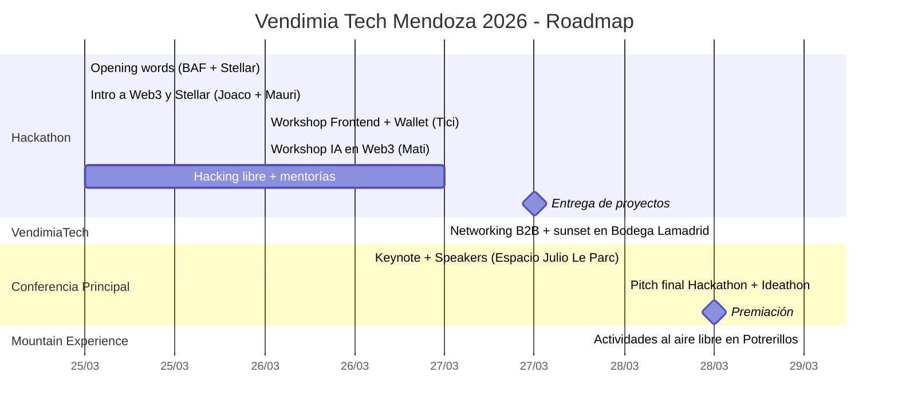

# Stellar AI Guide — Vendimia Tech Mendoza 2026

Guía práctica para desarrolladores que participan en la **Hackathon Vendimia Tech** (25-27 de marzo, 2026) en la Universidad Champagnat, Mendoza, Argentina.

El objetivo es que cada participante — sin importar su experiencia con Stellar, acceso a herramientas de AI pagas, o hardware — pueda construir algo funcional en 72 horas.

---

## Roadmap del evento

---

## Orden de lectura recomendado

| # | Archivo | Qué vas a encontrar |
|---|---------|---------------------|
| 0 | [Reglas_Hackathon.md](./Reglas_Hackathon.md) | **Leé esto primero** — Tracks, premios, criterios de evaluación, workshops |
| 1 | [Setup_AI_Gratis.md](./Setup_AI_Gratis.md) | Opciones de AI sin tarjeta de crédito ni suscripción |
| 2 | [Guia_Claude_Code.md](./Guia_Claude_Code.md) | Workflows con Claude Code: plan mode, agentes paralelos, testing |
| 3 | [Setup_Dev.md](./Setup_Dev.md) | API keys, testnet, configuración de Soroban, errores comunes |
| 4 | [Prompts_Iniciales.md](./Prompts_Iniciales.md) | Prompts listos para copiar y pegar en tu sesión de Claude Code |
| 5 | [Recursos_Hackathon.md](./Recursos_Hackathon.md) | Repos de referencia, starter packs, videos, comunidad |
| 6 | [Herramientas_AI.md](./Herramientas_AI.md) | Tools de AI para Stellar, asistentes de código, frameworks multi-agente |

---

## Contexto del evento

**Vendimia Tech 2026** es la 3ra edición del evento Web3 + AI más grande de Mendoza. Participan múltiples ecosistemas blockchain — esta guía se enfoca en el track de **Stellar**. El programa incluye:

- **Hackathon (25-27 marzo):** 72 horas, mentorías, premios en USD + becas. Gratis, cupos limitados.
- **VendimiaTech (27 marzo):** Networking B2B al atardecer en Bodega Lamadrid.
- **Conferencia principal (28 marzo):** +30 speakers, +2000 asistentes en Espacio Julio Le Parc.
- **Mountain Experience (29 marzo):** Actividades al aire libre en Potrerillos.

---

## Rails de pago en Argentina

A diferencia de otras guías enfocadas en SPEI (México) o PIX (Brasil), acá nos enfocamos en las opciones disponibles para Argentina:

- **Transferencias bancarias (CVU/CBU):** El estándar local para on/off ramps
- **Mercado Pago:** Ampliamente adoptado, API disponible para integración
- **Stablecoins ARS:** Opciones como Peso Digital y otros proyectos locales
- **USDC en Stellar:** El puente más directo entre crypto y fiat vía exchanges locales (Ripio, Lemon, Belo, Fiwind)
- **Anchors Stellar:** Servicios que conectan la red Stellar con el sistema financiero argentino

---

## Filosofía de esta guía

1. **Creada desde cero** — No es una copia de ningún otro recurso. Usamos experiencia real de hackathons LatAm.
2. **Práctica y opinada** — Te decimos qué funciona, qué rompe, y en qué orden hacer las cosas.
3. **Accesible** — Todo lo que recomendamos tiene una opción gratuita.
4. **Bilingüe cuando importa** — Documentación en español, código y comandos en inglés (como corresponde).

---

## Armada por la comunidad

[Buen Día Builders](https://github.com/BuenDia-Builders) · [CuyoConnect](https://cuyoconnect.com) · [BAF](https://www.fundacionblockchain.ar)

---

## Contribuir

Si encontrás un error o querés agregar algo, abrí un issue o un PR. Esta guía es de la comunidad.

## Licencia

MIT

---

Inspirada en [stellar-ai-guide-mx](https://github.com/kaankacar/stellar-ai-guide-mx), adaptada para Argentina.
